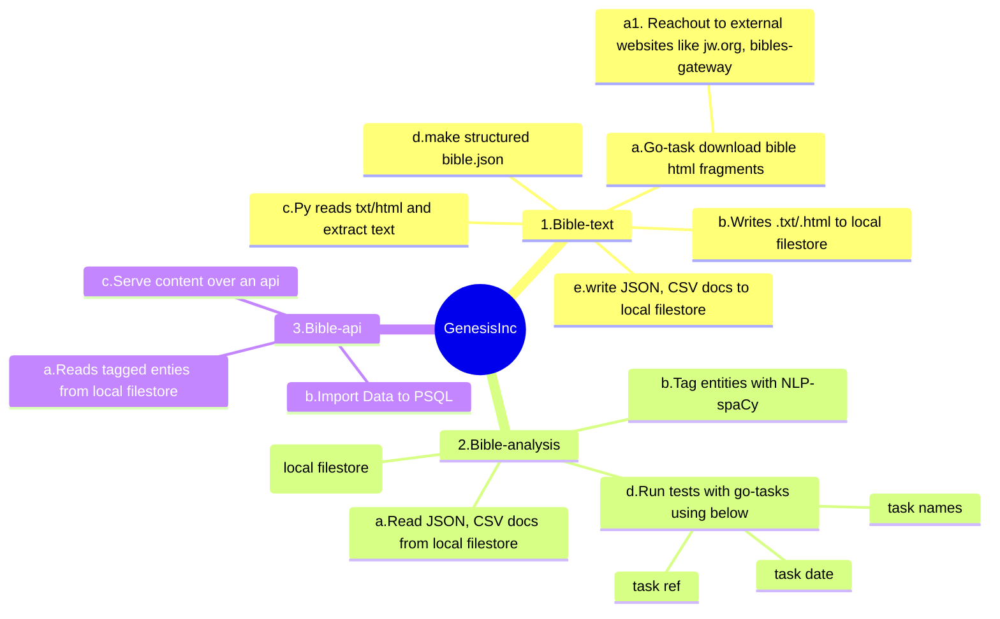

# bible text - analysis & data science

A hobby project to download multiple translations of bibles and load texts into a JSON file.
Output JSON will be used for bible analysis.

## graph flow
<!-- markdownlint-disable MD001 MD046 -->

## requirements

- [go-task/task](https://github.com/go-task/task)
- [astral-sh/uv](https://github.com/astral-sh/uv)
- [miller](https://github.com/johnkerl/miller)
- [jqlang/jq](https://github.com/jqlang/jq) (optional)
- [htmlq](https://github.com/mgdm/htmlq) - `brew install htmlq`

## Load bible to JSON

If you have the bible text in files, we need to load them to a json file using below task.

- generate bible-data.json from files

        ❯ task jsonify-bibles
            task: [load-gateway] uv run main.py load-gateway \
            --input-dir data/bibles/bible_gateway \
            --output-dir data/tmp

            data successfully written to data/tmp/multi_translation.json
            task: [load-jworg] uv run main.py load-jworg \
            --input-dir data/bibles/jw_org/nwt \
            --output-dir data/tmp

            # uv run main.py load-jworg --input-dir data/bibles/jw_org/nwt --output-dir here

            data successfully written to data/tmp/nwt_bible.json
            task: [merge-nwt-to-multi-translation] uv run main.py merge-translation \
            --translation nwt \
            --input-file data/tmp/nwt_bible.json \
            --output-file data/tmp/multi_translation.json

            Merged nwt translation saved to data/tmp/multi_translation.json

Now, you have the whole nwt bible in a file & all translations in multi-translation.json

## NWT study edition
<!-- markdownlint-disable MD001 no-bare-urls -->

- [Gen](https://wol.jw.org/en/wol/d/r1/lp-e/1001070105)
- [exo](https://wol.jw.org/en/wol/d/r1/lp-e/1001070106)
- [lev](https://wol.jw.org/en/wol/d/r1/lp-e/1001070107)
- [job](https://wol.jw.org/en/wol/d/r1/lp-e/1001070170)

sample downloads would look like below

    http 'https://wol.jw.org/en/wol/d/r1/lp-e/1001070105' | htmlq --text .v > gen.v.txt

    http 'https://wol.jw.org/en/wol/d/r1/lp-e/1001070106' | htmlq --text .v > exo.v.txt

## asv

some ASV translation links

- [Gen ch:6](https://wol.jw.org/en/wol/b/r1/lp-e/bi22/1/6#s=2&study=discover)
- [Gen ch:7](https://wol.jw.org/en/wol/b/r1/lp-e/bi22/1/7#study=discover)
- [Rev ch:7](https://wol.jw.org/en/wol/b/r1/lp-e/bi22/66/7#study=discover)

## RH

some rh links(the emphasized bible)

- [Gen 1](https://wol.jw.org/en/wol/b/r1/lp-e/rh/1/1#study=discover)
- [Gen 2](https://wol.jw.org/en/wol/b/r1/lp-e/rh/1/2#study=discover)
- [Rev 1](https://wol.jw.org/en/wol/b/r1/lp-e/rh/66/1#study=discover)
- [Psalm 150](https://wol.jw.org/en/wol/b/r1/lp-e/rh/19/150#study=discover)
